# TradLanka - AI-Powered E-Commerce Platform

**TradLanka** is a next-generation e-commerce solution designed to bridge the gap between traditional Sri Lankan sellers and the global market. Unlike standard platforms, it integrates **Artificial Intelligence** to offer features like Visual Image Search, Personalized Recommendations, and an Automated Chatbot Assistant.

---

## 🚀 Key Features

### 🧠 AI & Intelligent Features
- **📷 Visual Image Search**: Powered by **MobileNetV2** (Python/TensorFlow). Users can upload a photo of a product (e.g., a specific mask or spice) to find visually similar items in the store.
- **🎯 Smart Recommendations**: Uses **TF-IDF & Cosine Similarity** to suggest products based on a user's browsing history and content similarity.
- **🤖 AI Chatbot Assistant**: Integrated with **Google Dialogflow** to handle order tracking (`Where is my order?`) and product inquiries (`Tell me about Ceylon Tea`) in natural language.

### 🛒 E-Commerce Functionality
- **Multi-Vendor System**: Dedicated dashboards for **Admin**, **Sellers**, and **Customers**.
- **🌍 Real-Time Delivery Map**: Interactive maps using **Leaflet.js** and **OpenCage Geocoding** to track delivery zones and rider locations.
- **💳 Global Payments**: Secure international transactions via **Stripe** and local **Cash on Delivery (COD)** support.
- **🔔 Real-Time Notifications**: Automated email alerts (via SMTP) and dashboard notifications for new orders and stock updates.

---

## 🛠️ Technology Stack

| Component | Technology |
| :--- | :--- |
| **Backend Framework** | Laravel 11 (PHP 8.2+) |
| **Frontend** | Blade Templates, jQuery, AJAX, Bootstrap 5 |
| **Database** | MySQL |
| **AI Engine** | Python 3.10, Flask, TensorFlow, Scikit-learn |
| **Chatbot** | Google Dialogflow ES, Ngrok (Tunneling) |
| **Maps & Geocoding** | Leaflet.js, OpenCage API |
| **Payments** | Stripe API |

---

## 📸 Application Screens

Here is a look at the TradLanka user interface and management portals.

### 📊 Dashboards & User Profiles
* **Admin Dashboard**: 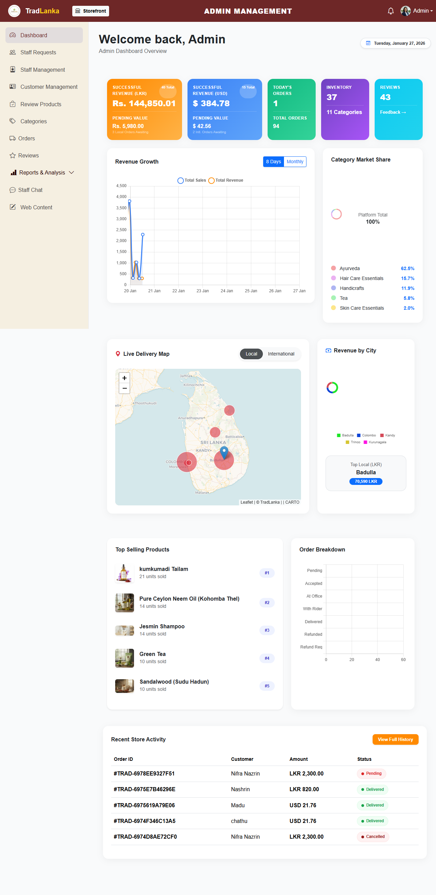
* **Seller Dashboard**: 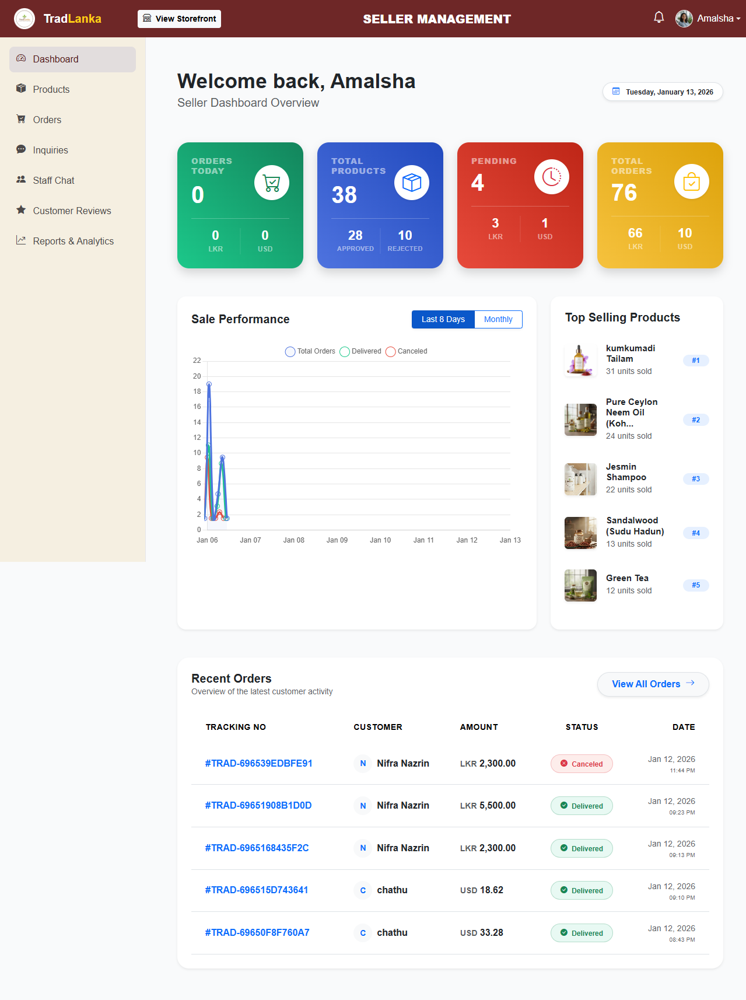
* **Delivery Dashboard**: 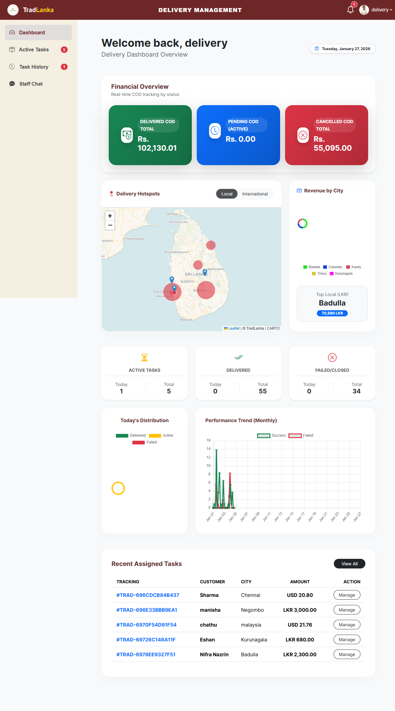
* **Customer Profile**: 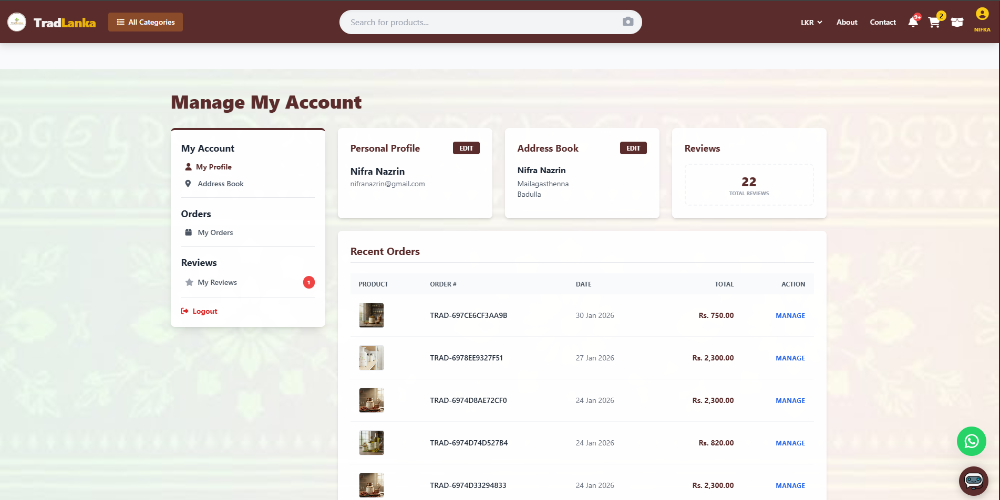

### 🛍️ Shopping & Core Features
* **Image Search**: 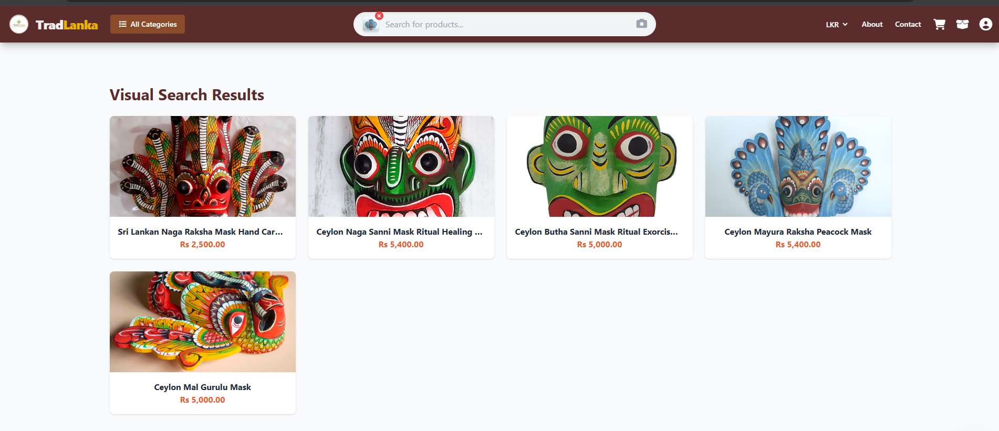
* **Live Search**: 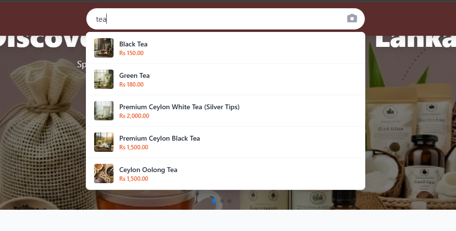
* **Product Recommendations**: 
* **Product Details Page**: 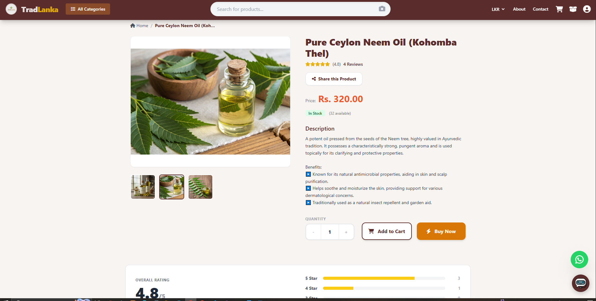
* **Order Tracking**: 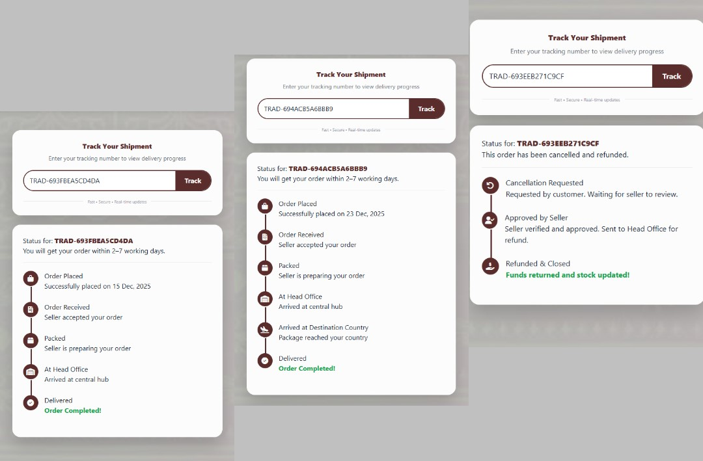
* **Login and Registration**: 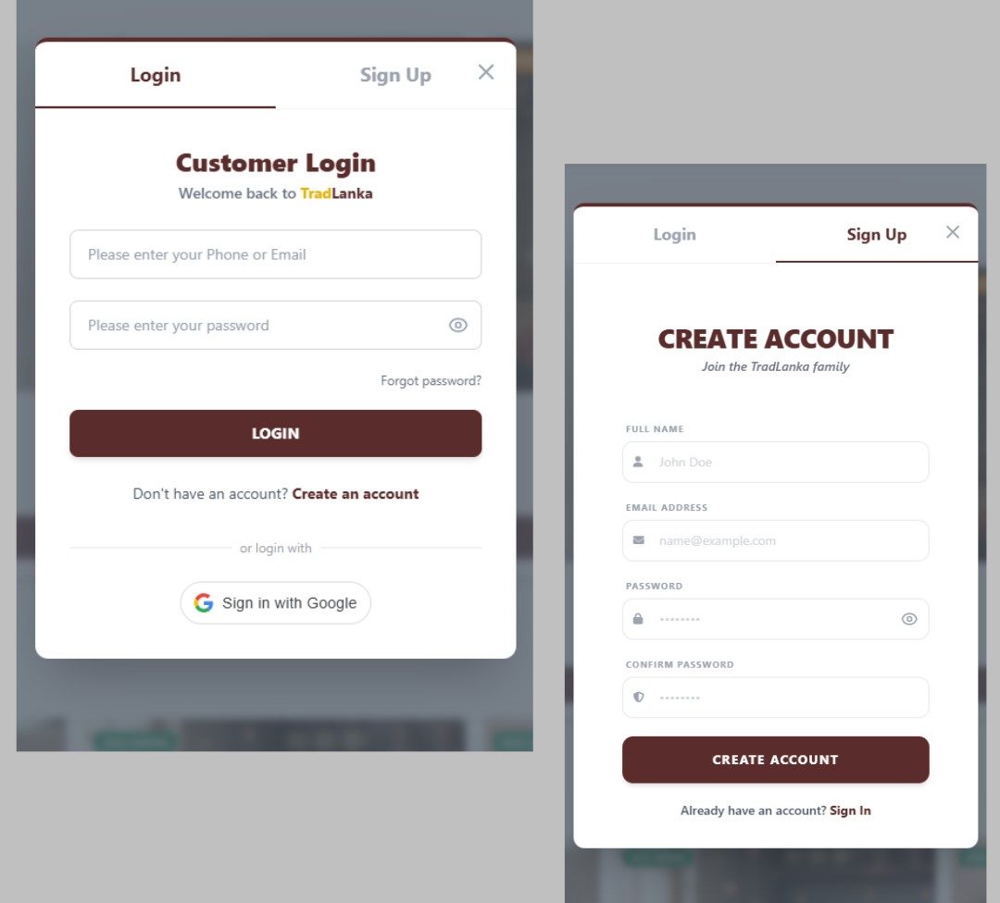

### ⚙️ Platform Management
* **Order Management**: 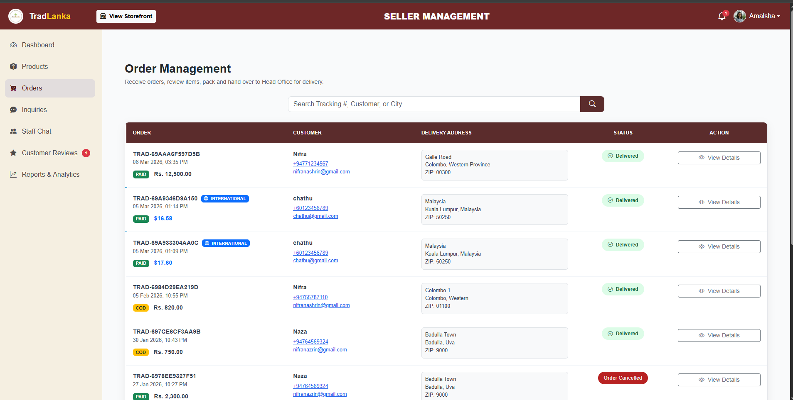
* **Delivery Management**: 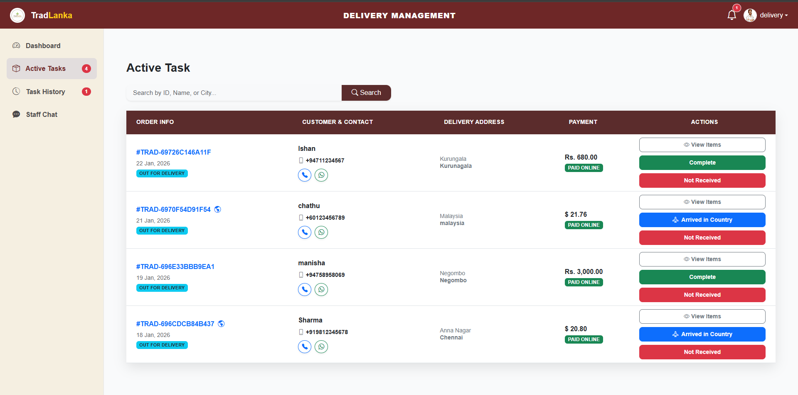
* **Add Category**: 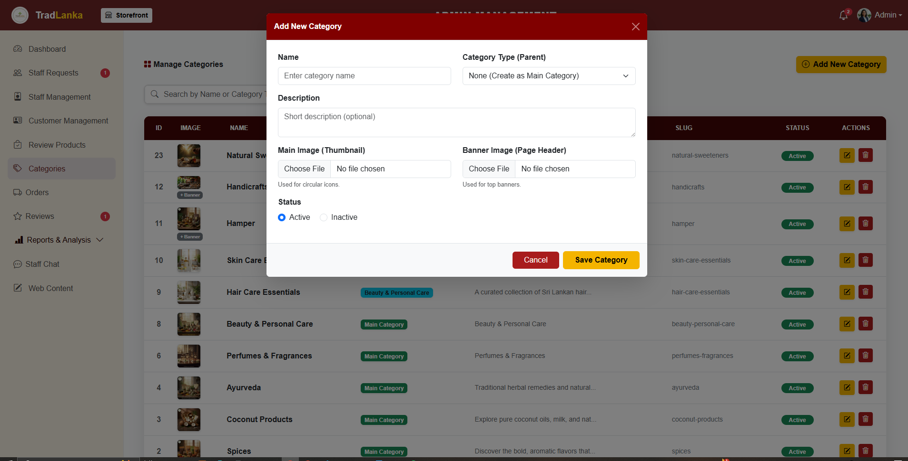
* **Add Products**: 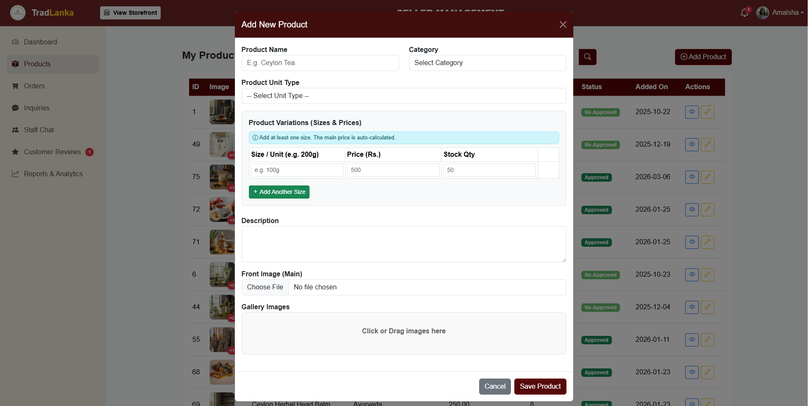
* **Email Notifications**: 
* **Product Inventory and Analytics**: 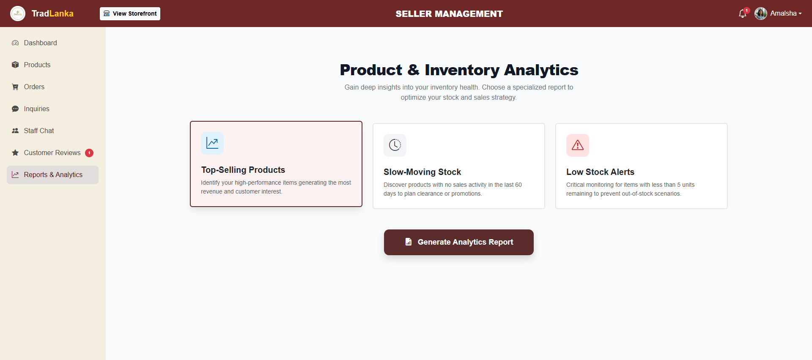
* **Sales Reports**: 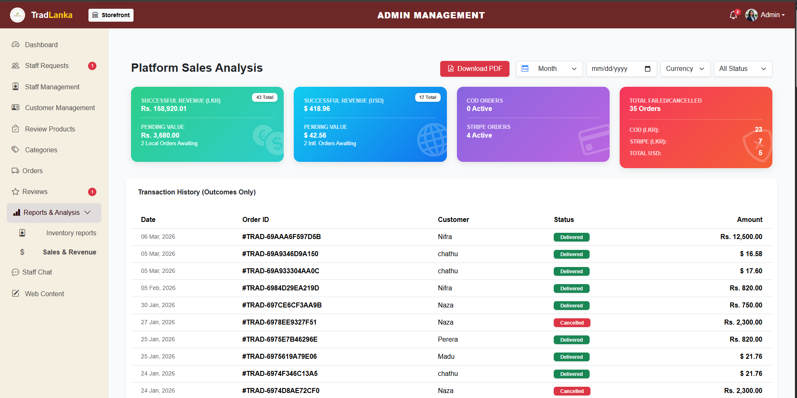
* **Staff Chat**: 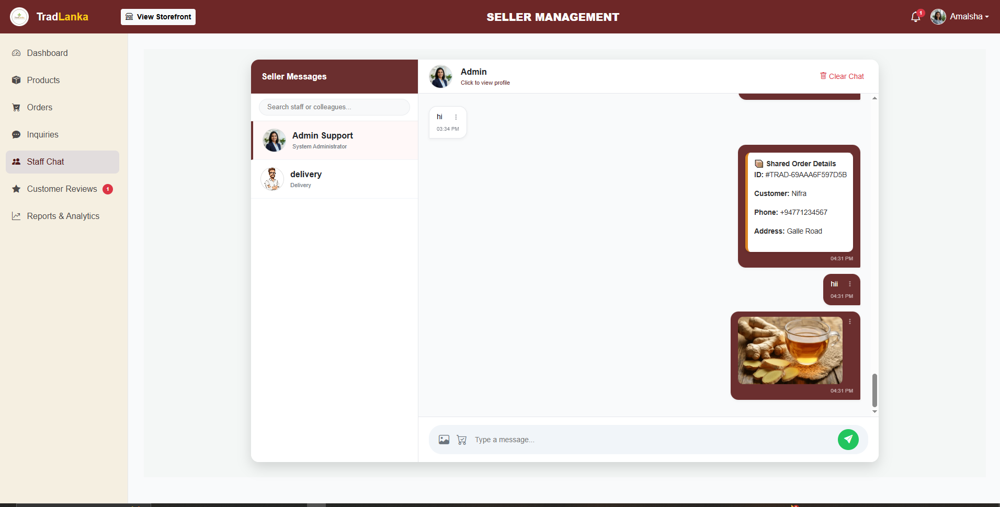

---

## ⚙️ Installation Guide

Follow these steps to set up the project locally.

### 1️⃣ Prerequisites
Ensure you have the following installed:
* [PHP 8.2+](https://www.php.net/) & [Composer](https://getcomposer.org/)
* [Python 3.10+](https://www.python.org/) & PIP
* [MySQL](https://www.mysql.com/) (via XAMPP or separate install)
* [Ngrok](https://ngrok.com/) (For Chatbot tunneling)

### 2️⃣ Laravel Backend Setup
```bash
# Clone the repository
git clone [https://github.com/nifranazrin/TradLanka.git](https://github.com/nifranazrin/TradLanka.git)
cd TradLanka

# Install PHP dependencies
composer install

# Create Environment File
cp .env.example .env

# Generate Application Key
php artisan key:generate
```
## Database Configuration

Create a database named `tradlanka_db` in MySQL.

### Update your `.env` file

```env
DB_DATABASE=tradlanka_db
DB_USERNAME=root
DB_PASSWORD=
````

### Run migrations and seeders

```bash
php artisan migrate --seed
```

### Link storage for images

```bash
php artisan storage:link
```

## 3️⃣ Python AI Engine Setup

Navigate to the AI service directory:

```bash
cd ai_service
````

### Install Python libraries

```bash
pip install flask tensorflow numpy scikit-learn pandas mysql-connector-python sqlalchemy
```

### Train the AI Models

```bash
python create_index.py       # Generates Visual Search Index (features.pkl)
python create_text_index.py  # Generates Recommendation Index (text_features.pkl)
```

---

## 4️⃣ Dialogflow Chatbot Configuration

Start Ngrok to tunnel your local server:

```bash
ngrok http 8000
```

Copy the **HTTPS URL** from Ngrok.

Go to **Dialogflow Console → Fulfillment** and paste:

```
https://your-ngrok-url.app/api/chatbot
```

---

## 🖥️ Usage

To run the full system, keep **3 terminal windows open**:

### 🔹 Laravel Server (Main Website)

```bash
php artisan serve
```

Access at:

```
http://127.0.0.1:8000
```

---

### 🔹 Python AI Server (Search Engine)

```bash
cd ai_service
python api_server.py
```

Running at:

```
http://127.0.0.1:5000
```

---

### 🔹 Ngrok Tunnel (Chatbot)

```bash
ngrok http 8000
```


